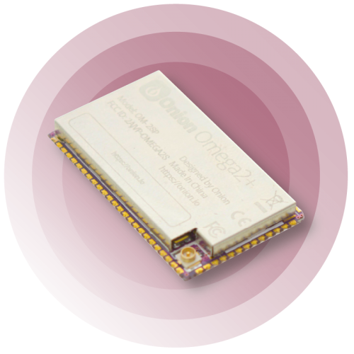

# Onion Omega2 IoT Computer

Files related to the Onion Omega2 IoT Computer family.

### Repository Contents

* [Documents](./Documents)
  * Datasheets
  * Product Brief
  * Certification Documents
  * Application Notes
* [Schematics](./Schematics)
  * Omega2S Design Reference Schematic
  * Omega2S Dev Board Schematic
* [Footprint](./Footprint)
  * Official Eagle Library
  * Altium Designer Library
  * PADS PCB Design Software Library
  * Footprint CAD File

## Models

| Device   | Packaging     | RAM   | Flash |
|----------|---------------|-------|-------|
| Omega2   | Through-hole  | 64MB  | 16MB  |
| Omega2+  | Through-hole  | 128MB | 32MB  |
| | | | |
| Omega2S  | Surface-mount | 64MB  | 16MB  |
| Omega2S+ | Surface-mount | 128MB | 32MB  |

## Omega2S

Information about ordering can be found here: https://onion.io/omega2s/

