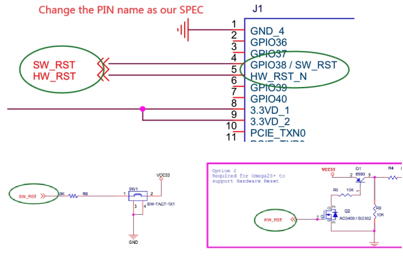
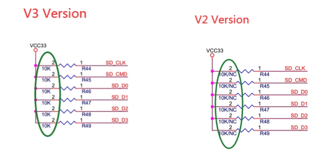
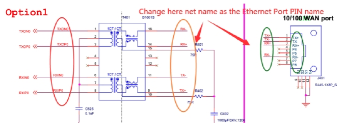

# Schematics Related to the Omega2S

## `Omega2S-Reference-Schematic.pdf`

Reference schematic for use with the Omega2S

### Updates

Version 3 - Jun 4, 2020

* Page 1 - Change Reset pin names (and connected nets) to match datasheet
  * 
* Page 3 - eMMC circuit: Remove NC description to avoid confusion
  * 
* Page 5 - Ethernet circuit: Change the net names to match ethernet port pin names to avoid confusion
  * 

Version 2 - Apr 8, 2020

* Omega2S bottom pad changed to N/C

Version 1

* May 7, 2018
    * Added descriptive comments
* Mar 17, 2018
    * Initial version

## `Omega2S-Dev-Board.pdf`

Schematics of the Omega2S Development board. The schematic contains the designs for both variants:

* [SD Card Version](https://onion.io/store/omega2s-development-kit-sd-card-version/)
* [eMMC Version](https://onion.io/store/omega2s-development-kit-emmc-version/)

### Updates

* Jan 24, 2019
    * Fixed PCIe pinout
    * eMMC: Added note that GPIO18-21 are not required to be connected to the eMMC chip
* Mar 17, 2018
    * Initial version
